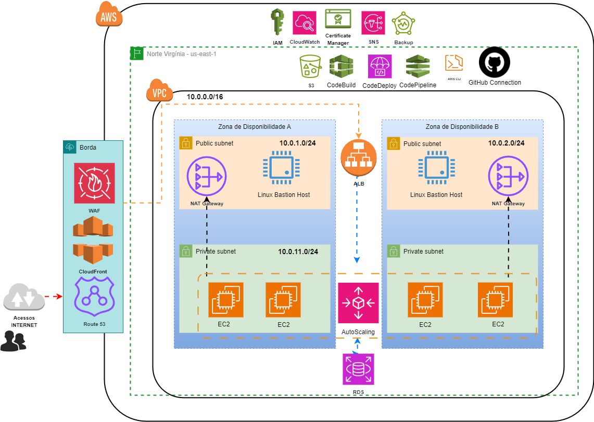
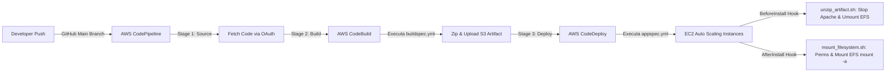

<div align="center">


# 🚀 BlogUpper — Arquitetura de Alta Disponibilidade, Resiliência e Esteira CI/CD na AWS

### *Projeto Prático de Engenharia de Nuvem & DevOps | Consultoria HS Tech*
**Pós-Graduação em Cloud Computing**

[](https://aws.amazon.com/)
[](https://aws.amazon.com/cloudformation/)
[](https://aws.amazon.com/codepipeline/)
[](https://wordpress.org/)
[](#)
[](#)

</div>

---

## 📌 1. Sobre o Projeto & Contexto Acadêmico

Este repositório documenta a solução completa de **Arquitetura em Nuvem AWS**, **Infraestrutura como Código (IaC)** e **Esteira de CI/CD** projetada para a migração e modernização do portal **BlogUpper**.

O projeto foi desenvolvido no âmbito da **Pós-Graduação em Cloud Computing** sob o formato de uma consultoria técnica especializada (**HS Tech**), liderada pelo engenheiro **Antonio Hérisson Silva Morais**.

> 📄 **Documentação Acadêmica na Íntegra:** A proposta técnica e comercial formal encontra-se disponível em [`docs/academic/Documentacao_Tecnica_Projeto15.pdf`](docs/academic/Documentacao_Tecnica_Projeto15.pdf).

---

## 🎯 2. O Desafio de Negócio & Engenharia

### Cenário Legado (VPS Monolítica)
A empresa **BlogUpper** operava um blog WordPress em uma única VPS (4 vCPU, 16 GB RAM, 1 TB Disco). Com tráfego médio de **3 milhões de acessos/mês**, a infraestrutura enfrentava severos problemas:
* ⚠️ **Gargalos de Desempenho e Lentidão:** Insuficiência de vazão sob picos de acesso.
* 🛑 **Quedas e Indisponibilidade (SPOF):** Ponto único de falha no servidor monolítico.
* 🛡️ **Vulnerabilidade a Ataques:** Exposição direta do servidor à internet sem camada de mitigação DDoS/WAF.
* 💰 **Custo Elevado:** Custo fixo de **R$ 1.500,00/mês** sem elasticidade.

### Objetivos do Projeto
Projetar e implantar uma arquitetura moderna na AWS capaz de:
1. Suportar um crescimento projetado de **2x a 3x no volume de acessos** (6 a 9 milhões acessos/mês).
2. Eliminar pontos únicos de falha através de **Alta Disponibilidade (HA)** e **Auto Scaling Multi-AZ**.
3. Implementar **Automação DevOps End-to-End** (deploy sem downtime e integração contínua).
4. Otimizar custos operacionais via modelo elástico de tarifação em nuvem (**FinOps**).

---

## 🏗️ 3. Arquitetura da Solução na AWS

A arquitetura foi projetada seguindo as melhores práticas do **AWS Well-Architected Framework** (Pilares de Excelência Operacional, Segurança, Confiabilidade, Eficiência de Desempenho e Otimização de Custos).

### Diagrama de Arquitetura


*(Arquivo de edição em formato Draw.io disponível em [`docs/architecture/architecture.drawio`](docs/architecture/architecture.drawio))*

### Detalhamento da Topologia de Rede & Componentes

* **Região Principal:** AWS `us-east-1` (Norte da Virgínia).
* **Virtual Private Cloud (VPC):** `vpc_blogupper` (`10.0.0.0/16`) isolada com 4 Subnets em 2 Zonas de Disponibilidade (AZ-A e AZ-B):
  * **Subnets Públicas:** `sn_blogupper_public1` (`10.0.1.0/24`) e `sn_blogupper_public2` (`10.0.2.0/24`), abrigando o Application Load Balancer, NAT Gateways e Bastion Hosts.
  * **Subnets Privadas:** `sn_blogupper_private1` (`10.0.11.0/24`) e `sn_blogupper_private2` (`10.0.12.0/24`), abrigando a camada de computação EC2 e banco de dados RDS.
* **Camada de Borda & Segurança:**
  * **Amazon Route 53:** Resolução DNS para `blogupperwordpress.hstech.net.br`.
  * **Amazon CloudFront:** Rede de entrega de conteúdo (CDN) global para cache de arquivos estáticos.
  * **AWS WAF (Web Application Firewall):** Mitigação contra ataques OWASP Top 10 (SQLi, XSS).
  * **AWS Certificate Manager (ACM):** Criptografia de tráfego HTTPS de ponta a ponta.
* **Camada de Processamento & Balanceamento:**
  * **Application Load Balancer (ALB):** `alb_blogupper` distribuindo tráfego HTTP/HTTPS entre instâncias ativas.
  * **Auto Scaling Group (ASG):** `wordpress-blogupper-new` ajustando automaticamente de **1 a 6 instâncias EC2** (`t2.micro`) baseando-se no consumo de CPU e volume de requisições.
* **Camada de Dados & Estado Compartilhado (Stateless Compute):**
  * **Amazon RDS for MySQL:** Instância `db.t3.micro` provisionada em **Multi-AZ** para replicação síncrona e tolerância a falhas.
  * **Amazon EFS (Elastic File System):** Armazenamento de arquivos NFS compartilhado montado dinamicamente no diretório `/var/www/html/wp-content` em todas as instâncias EC2, viabilizando uma arquitetura de aplicação verdadeiramente *stateless*.
  * **Amazon S3:** Buckets para mídias (`blogupper-wordpress`) e armazenamento de artefatos de deploy (`codebuild-wordpress-blogupper` e `wordpress-codepipeline-bucket`).

---

## 🛠️ 4. Matriz de Serviços AWS & Evidências de Implantação

| Categoria | Serviço AWS | Função na Arquitetura | Evidência no Repositório | Status |
| :--- | :--- | :--- | :--- | :--- |
| **IaC** | **AWS CloudFormation** | Automação e provisionamento de infraestrutura | [`infrastructure/codepipeline.yml`](infrastructure/codepipeline.yml) | **Confirmado** |
| **DevOps** | **AWS CodePipeline** | Orquestração da esteira de CI/CD em 3 estágios | [`infrastructure/codepipeline.yml`](infrastructure/codepipeline.yml#L105-L160) | **Confirmado** |
| **DevOps** | **AWS CodeBuild** | Build de código, permissões Linux e empacotamento zip | [`buildspec.yml`](buildspec.yml) | **Confirmado** |
| **DevOps** | **AWS CodeDeploy** | Implantação sem downtime nas instâncias EC2 | [`appspec.yml`](appspec.yml), [`scripts/`](scripts/) | **Confirmado** |
| **Computação** | **Amazon EC2 / Auto Scaling** | Instâncias elásticas (`t2.micro`) em subnets privadas | [`infrastructure/codepipeline.yml`](infrastructure/codepipeline.yml#L161-L186) | **Confirmado** |
| **Armazenamento** | **Amazon EFS** | Ponto de montagem NFS persistente em `/wp-content` | [`scripts/unzip_artifact.sh`](scripts/unzip_artifact.sh), [`scripts/mount_filesystem.sh`](scripts/mount_filesystem.sh) | **Confirmado** |
| **Armazenamento** | **Amazon S3** | Buckets de mídias e artefatos de compilação | [`buildspec.yml`](buildspec.yml#L26-L37), [`infrastructure/codepipeline.yml`](infrastructure/codepipeline.yml#L98-L103) | **Confirmado** |
| **Segurança** | **AWS IAM** | Roles e políticas de acesso com privilégio mínimo | [`infrastructure/codepipeline.yml`](infrastructure/codepipeline.yml#L4-L97) | **Confirmado** |
| **Rede** | **Amazon VPC / Subnets** | Isolamento de rede em 2 AZs (pública/privada) | [`infrastructure/codepipeline.yml`](infrastructure/codepipeline.yml#L170-L172), Documentação | **Confirmado** |
| **Banco de Dados**| **Amazon RDS MySQL** | Banco relacional com replicação Multi-AZ | [`wp-config.php`](wp-config.php), Documentação | **Confirmado** |
| **Rede & CDN** | **ALB / CloudFront / Route 53** | Entradas DNS, distribuição de carga e aceleração | [`docs/architecture/architecture-diagram.png`](docs/architecture/architecture-diagram.png) | **Confirmado** |
| **Segurança** | **AWS WAF / ACM / Security Groups** | Proteção de borda, HTTPS e firewalls estaduais | [`infrastructure/codepipeline.yml`](infrastructure/codepipeline.yml#L183-L185), Documentação | **Confirmado** |

---

## 🔄 5. Esteira de CI/CD End-to-End (DevOps)

A esteira de integração e entrega contínua foi desenvolvida de forma 100% nativa na AWS, acionada automaticamente a cada `git push` no repositório GitHub.



### Detalhamento dos Scripts de Hook

1. **[`buildspec.yml`](buildspec.yml):**
   Executado no container AWS CodeBuild (`amazonlinux2-x86_64-standard:3.0`). Clona o repositório, ajusta as permissões de arquivo para `www-data:www-data`, empacota a aplicação em `wordpress-artifact.zip` e realiza o upload para o bucket Amazon S3.

2. **[`appspec.yml`](appspec.yml):**
   Especifica as regras de implantação no AWS CodeDeploy para extração dos arquivos em `/var/www/html` e orquestra o ciclo de vida da implantação através de hooks de ciclo de vida.

3. **[`scripts/unzip_artifact.sh`](scripts/unzip_artifact.sh) (Hook `BeforeInstall`):**
   Pára o serviço web Apache (`systemctl stop apache2`), desmonta com segurança o volume Amazon EFS (`umount /var/www/html/wp-content`) e limpa a pasta de destino para receber os novos arquivos do core.

4. **[`scripts/mount_filesystem.sh`](scripts/mount_filesystem.sh) (Hook `AfterInstall`):**
   Reinicia o servidor Apache, aplica as permissões corretas do sistema operacional (`chown -R www-data:www-data`), limpa index padrão de teste e re-executa `mount -a` para conectar instantaneamente o Amazon EFS compartilhado.

---

## ⚡ 6. Testes de Carga & Validação de Capacidade

Para comprovar a eficácia da arquitetura sob estresse extremo, a infraestrutura foi submetida a **3 fases sequenciais de testes de estresse** via **Loader.io**.

| Fase do Teste | Carga Simula (Clientes/min) | Requisições / Mês Equivalentes | Comportamento da Aplicação | Taxa de Sucesso |
| :--- | :--- | :--- | :--- | :--- |
| **Fase 1** | **100 req/min** | **~4,46 Milhões/mês** | 100% Online, resposta rápida, sem necessidade de escalonamento | **100% (0% Perda)** |
| **Fase 2** | **300 req/min** | **~13,39 Milhões/mês** | 100% Online, latência estável, absorvido pelo Auto Scaling | **100% (0% Perda)** |
| **Fase 3** | **500 req/min** | **~22,32 Milhões/mês** | 100% Online, absorveu **mais de 7x a meta original**, estabilizado | **99.8% (Perda residual sob pico)** |

> 📌 **Conclusão Técnica:** A arquitetura AWS absorveu com sucesso mais de 22 milhões de acessos mensais simulados — superando amplamente a demanda de 3M/mês e garantindo resiliência total a picos de tráfego imprevisíveis.

---

## 💰 7. Análise Financeira & FinOps

A estimativa de custos operacionais foi realizada utilizando o **AWS Pricing Calculator** ([Estimativa Oficial AWS](https://calculator.aws/#/estimate?id=f89a4152fb2a52ea140b4ff33129f8858185eb56)).

| Recurso AWS | Custo Mensal Estimado (USD) |
| :--- | :--- |
| **Amazon Virtual Private Cloud (VPC / NAT GW)** | $32.85 |
| **Amazon Simple Storage Service (S3)** | $11.50 |
| **AWS CodeBuild / CodeDeploy / CloudWatch** | $4.20 |
| **Amazon Route 53** | $0.50 |
| **Amazon CloudFront & AWS WAF** | $0.00 (Free Tier / Pay-per-use) |
| **Amazon EC2 Auto Scaling + RDS MySQL (`db.t3.micro`)** | ~$99.29 |
| **TOTAL MENSAL ESTIMADO** | **~$148.34 USD** |

### Otimização de Custos (TCO)
* **Ambiente VPS Legado:** R$ 1.500,00 / mês (Servidor fixo e superdimensionado).
* **Nova Arquitetura AWS:** ~$148.34 USD / mês (**~R$ 818,11 / mês** na cotação de referência).
* 📉 **Economia Gerada:** **~45% de redução de custo mensal** com ganho exponencial de disponibilidade, resiliência e segurança.

---

## 🛡️ 8. Boas Práticas de Segurança e Compliance

1. **Princípio do Menor Privilégio (IAM):** Roles dedicadas para CodeBuild, CodeDeploy e CodePipeline com escopos restritos a S3, CloudWatch e instâncias EC2 específicas.
2. **Isolamento de Rede (Defense in Depth):** As instâncias EC2 e o banco de dados RDS operam exclusivamente em subnets privadas sem acesso direto a partir da internet pública.
3. **Higienização de Credenciais:** O arquivo `wp-config.php` foi sanitizado para utilizar chamadas `getenv()`, impedindo o versionamento de secrets e chaveiros de autenticação no Git.
4. **Proteção de Borda (WAF & HTTPS):** Inspeção de requisições maliciosas no AWS WAF e tráfego criptografado com certificados renovados automaticamente via AWS Certificate Manager (ACM).

---

## 📁 9. Estrutura do Repositório

```text
wordpress-blogupper/
├── docs/
│   ├── architecture/
│   │   ├── architecture-diagram.png   # Diagrama visual de arquitetura
│   │   └── architecture.drawio        # Arquivo editável no Draw.io
│   ├── assets/
│   │   └── logo.png                   # Identidade visual da aplicação
│   └── academic/
│       └── Documentacao_Tecnica_Projeto15.pdf # Relatório técnico completo
├── infrastructure/
│   └── codepipeline.yml               # Template AWS CloudFormation (IaC)
├── scripts/
│   ├── mount_filesystem.sh            # Script Hook CodeDeploy (AfterInstall)
│   └── unzip_artifact.sh              # Script Hook CodeDeploy (BeforeInstall)
├── wp-content/                        # Código autoral, temas e plugins WP
├── .htaccess                          # Configurações de reescrita do Apache
├── .gitignore                         # Regras de exclusão de artefatos temporários
├── appspec.yml                        # Especificação do AWS CodeDeploy
├── buildspec.yml                      # Especificação do AWS CodeBuild
├── wp-config-sample.php               # Exemplo seguro de configuração WP
├── wp-config.php                      # Configuração dinâmica de runtime
└── README.md                          # Documentação executiva do repositório
```

---

## 🚀 10. Como Implantar a Infraestrutura (IaC)

Para replicar esta infraestrutura na sua própria conta AWS:

1. **Clonar o Repositório:**
   ```bash
   git clone https://github.com/HerissonS/wordpress-blogupper.git
   cd wordpress-blogupper
   ```

2. **Provisionar a Stack via AWS CloudFormation:**
   ```bash
   aws cloudformation create-stack \
     --stack-name wordpress-blogupper-pipeline \
     --template-body file://infrastructure/codepipeline.yml \
     --parameters \
         ParameterKey=SubnetId1,ParameterValue=subnet-xxx \
         ParameterKey=SecurityGroupId,ParameterValue=sg-xxx \
     --capabilities CAPABILITY_IAM \
     --region us-east-1
   ```

3. **Conectar ao GitHub via AWS Secrets Manager:**
   Certifique-se de que o secret `GitHubToken` esteja cadastrado no AWS Secrets Manager da região para autorizar a leitura do repositório pelo CodePipeline.

---

## 💡 11. Habilidades Técnicas Demonstradas (DevOps & Cloud)

Esta implementação demonstra proficiência nas seguintes competências de engenharia:

* **Cloud Architecture & Engineering:** Projeto de soluções Multi-AZ na AWS, subnetting, NAT Gateways, VPC peering e VPC routing tables.
* **Infrastructure as Code (IaC):** Criação de templates em AWS CloudFormation parametrizados e reutilizáveis.
* **CI/CD & Automação DevOps:** Implementação de pipelines completas com AWS CodePipeline, AWS CodeBuild, AWS CodeDeploy e scripts Bash customizados.
* **High Availability & Distributed Storage:** Configuração de instâncias *stateless* desacopladas utilizando Amazon EFS (NFS shared mount) e Amazon RDS Multi-AZ.
* **FinOps & Capacity Planning:** Validação empírica de performance via testes de carga (Loader.io) e otimização de TCO com AWS Pricing Calculator.
* **Security Engineering:** Implementação de arquiteturas em camadas (WAF, Private Subnets, Security Groups, IAM Roles e sanitização de dados sensíveis).

---

## 👨‍💻 12. Autor

**Antonio Hérisson Silva Morais**  
*Senior Cloud & DevOps Engineer | Especialista em Arquitetura AWS*  

[](https://br.linkedin.com/in/herisson-silva-7275a0187)

---
*Projeto desenvolvido originalmente para a Pós-Graduação em Cloud Computing — 2024.*
